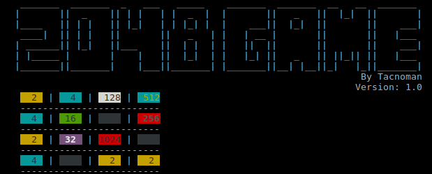

# 2048 game in rust lang

To run, you must clone the project first.

```sh
  $ git clone git@github.com:tacnoman/2048-rust.git
```

Build with:

```sh
  $ cargo build
```

And run:

```sh
  $ cargo run
```

And let's funny. You can use `w`, `a`, `s` and `d` to command the game.

Bugs?

`Tacnoman <renatocassino@gmail.com>`

## Screenshot


